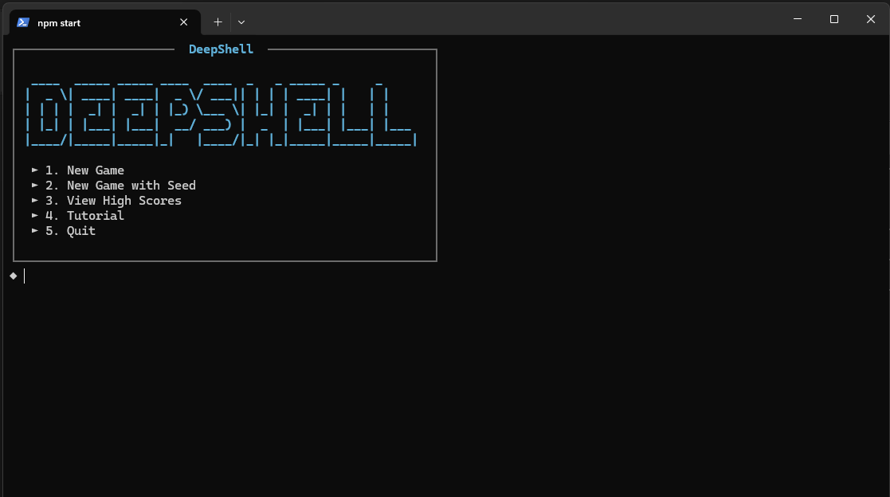
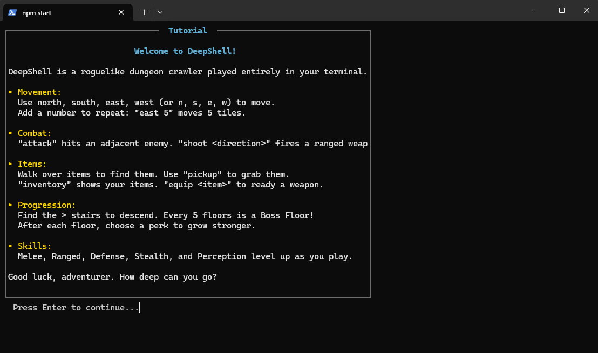
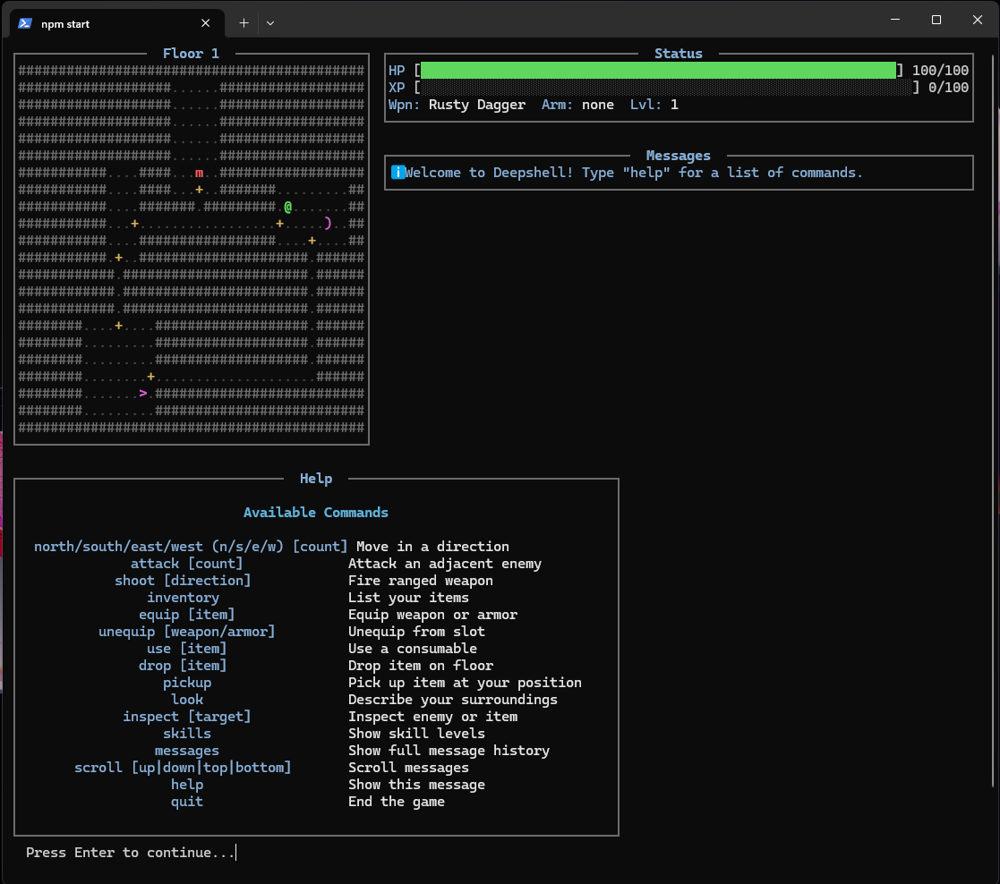
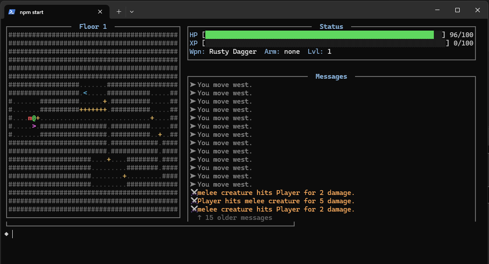
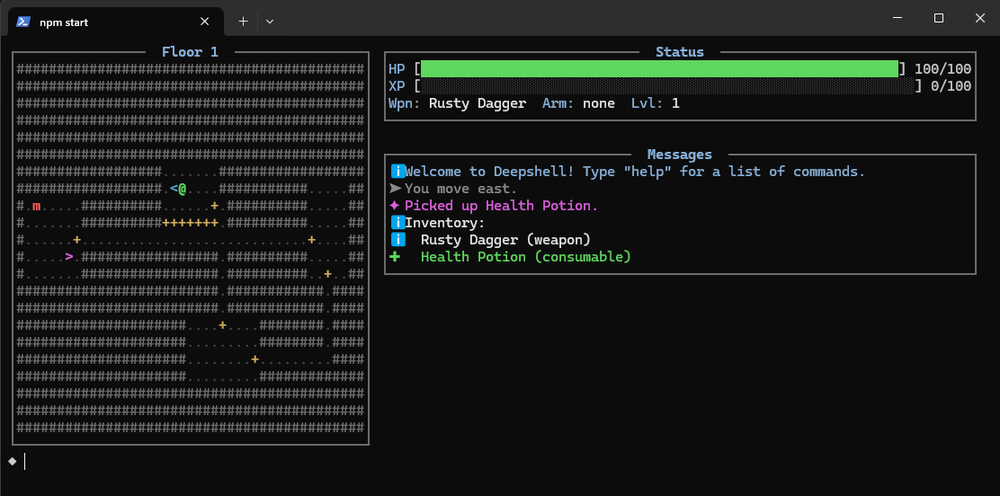
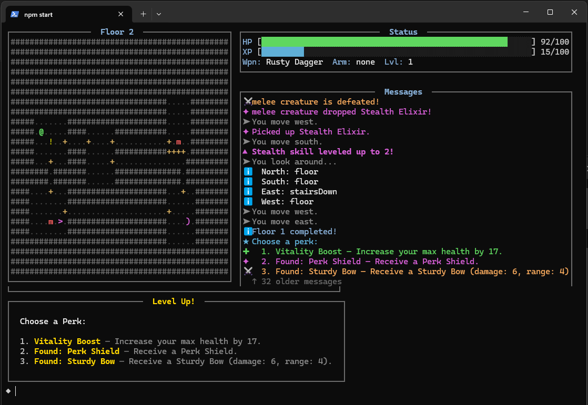

# DeepShell

A polished CLI roguelike dungeon crawler built in TypeScript. Explore procedurally generated dungeons, battle enemies, collect loot, and see how deep you can go — all from the comfort of your terminal.



## Features

- **Procedural Dungeon Generation**: Every floor is uniquely generated with rooms, corridors, and secrets
- **Turn-Based Combat**: Strategic melee and ranged combat with skill progression
- **Skill System**: Level up 5 different skills — Melee, Ranged, Defense, Stealth, and Perception
- **Perk System**: Choose powerful perks after clearing each floor
- **Boss Battles**: Face challenging bosses every 5 floors
- **Seeded Runs**: Share seeds with friends for the same dungeon layout
- **High Scores**: Track your best runs

## UI Features

- **Responsive Panel Layout**: Wide terminals show the map, status, and messages side-by-side; narrow terminals fall back to a clean stacked view
- **Visual Status Bars**: HP and XP bars with dynamic color shifts (green → yellow → red)
- **Box-Drawn Panels**: Unicode border frames surround every screen element for a crisp, organized look
- **Contextual Message Icons**: Combat, loot, level-ups, movement, and warnings each get their own icon and color
- **Help Overlay**: `help` opens a clean command reference overlay without cluttering your message log
- **Built-in Tutorial**: New players can jump straight into a guided tutorial from the title screen
- **Cinematic Boot Sequence**: A typewriter-style intro welcomes you into the DeepShell

## Screenshots

### Title Screen & Tutorial

| Title Screen | How to Play |
|:------------:|:-----------:|
|  |  |

### Dungeon Exploration & Combat

| Floor 1 — Exploration | Combat Messages |
|:---------------------:|:---------------:|
|  |  |

### Items & Progression

| Inventory & Pickups | Perk Selection |
|:--------------------:|:--------------:|
|  |  |

## Installation

```bash
# Clone the repository
git clone https://github.com/SBrophy-dev/deepshell.git
cd deepshell

# Install dependencies
npm install

# Build the project
npm run build
```

## Playing

```bash
npm start
```

## Commands

| Command | Alias | Description |
|---------|-------|-------------|
| `north` | `n` | Move north |
| `south` | `s` | Move south |
| `east` | `e` | Move east |
| `west` | `w` | Move west |
| `attack` | `a` | Attack adjacent enemy |
| `shoot [direction]` | | Fire ranged weapon |
| `inventory` | `i` | List your items |
| `equip [item]` | | Equip a weapon or armor |
| `unequip [weapon/armor]` | | Unequip from a slot |
| `use [item]` | | Use a consumable item |
| `drop [item]` | | Drop an item on the floor |
| `pickup` | | Pick up item at your position |
| `look` | `l` | Describe surroundings |
| `inspect [target]` | | Inspect enemy or item |
| `skills` | | Show skill levels |
| `help` | `?` | Show help overlay |
| `quit` | `q` | End the game |

## ASCII Legend

| Symbol | Meaning |
|--------|---------|
| `@` | Player |
| `#` | Wall |
| `.` | Floor/Corridor |
| `+` | Door |
| `<` | Stairs up (entry) |
| `>` | Stairs down (exit) |
| `m` | Melee enemy |
| `r` | Ranged enemy |
| `p` | Patrol enemy |
| `B` | Boss |
| `)` | Weapon |
| `[` | Armor |
| `!` | Item |

## Development

```bash
# Run tests
npm test

# Run tests in watch mode
npm run test:watch
```

## Tech Stack

- **TypeScript** — Type-safe JavaScript
- **Node.js** — Runtime environment
- **Chalk** — Terminal styling and colors
- **Vitest** — Testing framework with property-based testing support

## License

MIT
